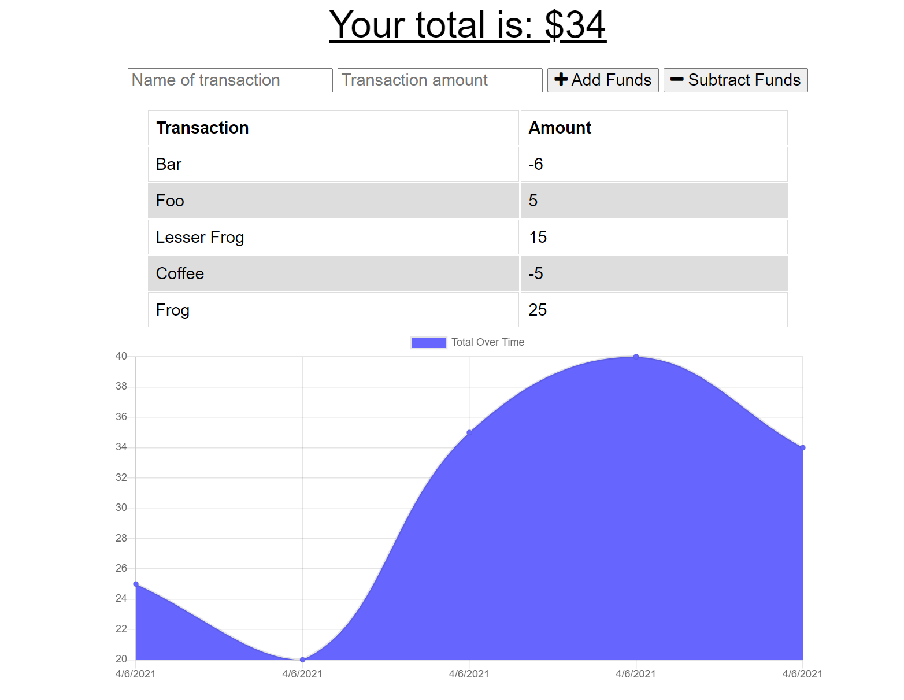

# PWA_BUDGETTRACKER

## Description

This application uses an indexed DB and a webmanifest to store user-inputted budgeting data. Express, mongoose, and morgan are also dependencies of this app. Heroku is used for deployment.

## Installation 
If installing locally, navigate to PWA_BudgetTracker directory and run "npm i" to install dependencies. 

The deployed application can be found here: 
https://stormy-tor-19575.herokuapp.com/

## Screenshots
Homepage:

## Questions
* [GitHub Profile](http://github.com/Osteophagy)